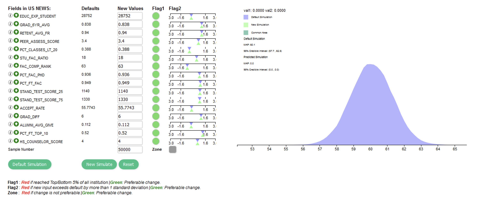
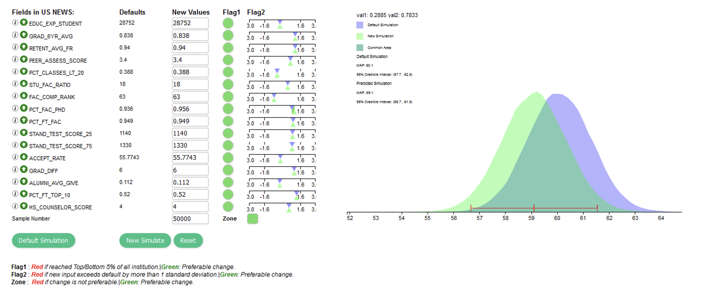

**USNews Simulator**

A visual analytical tool which simulates *UGA ranking based on
quantitative and qualitative measures that education experts have
proposed as a reliable indicator of academic quality*.

**USNews**: The college experience cannot be measured by a series of
data points. But for families concerned with finding the best academic
value for their money, USNews Best College Ranking provide an excellent
starting point for the search. They help you compare at a glance the
relative quality of institutions based on such widely accepted
indicators of excellence as first-year retention rates, graduation rates
and the strength of the faculty.

The USNews ranking system rests upon two pillars. The formula uses
quantitative and qualitative measures that education experts have
proposed as reliable indicators of academic quality, and it is based on
research view of what matters in education.

First, school are categorized by their mission, which is derived from
the breakdown of types of higher education institutions originally
developed by Carnegie Foundation for the advancement of Teaching. The
categories are:

-   **National Universities** offer a full range of undergraduate majors
    plus master's and Ph.D. programs and emphasize faculty research.

-   **National Liberal Arts colleges** focus almost exclusively on
    undergraduate education; they awarded at least 50 percent of their
    degrees in the arts and sciences.

-   **Regional Universities** offer a broad scope of undergraduate
    degrees and some master's degree programs but few, if any, doctoral
    programs.

-   **Regional Colleges** focus on undergraduate education but grant
    fewer than 50 percent of their degrees in liberal arts disciplines,
    it also includes schools that have small bachelor's degree program
    but primarily grant two-year associate degrees.

**Regional Universities and Regional Colleges** are further divided and
ranked in four geographical groups North, South, Midwest, and West.

**[Purpose]{.underline}**

1.  The indicator we use to capture academic quality fall into a number
    of groupings:

-   Assessment by administrators at **peer institutions**.

-   How well schools **retain graduate students**.

-   **Quality of their faculty**.

-   **Investment in their faculty**.

-   **Admissions selectivity**.

-   **Financial resources**.

-   **Alumni giving**.

2.  The indicators include input measures that reflects school's.

-   **Student bodies**

-   **Faculties**

-   **Resources**.

3.  The indicators also include outcome measures that signal .

-   How well institutions are engaging and educating their students.

An explanation of the measures and their weightings in the ranking
formula can be found at usnews.com/collegemeth.

**Table 1-US News Inputs Groups**

  -----------------------------------------------------------------------
  **Input Groups**                                       **Weight**
  ------------------------------------------------------ ----------------
  Retention                                              22.5 %

  Assessment by peers and counselors                     22.5 %

  Faculty resources                                      20 %

  Student selectivity                                    12.5 %

  Financial resources                                    10 %

  Graduation rate performance                            7.5 %

  Alumni giving rate                                     5 %
  
  -----------------------------------------------------------------------

**Retention:** **\[22.5%\]** The Higher the proportion of first year
student who returned to campus for sophomore year and eventually
graduate, the better a school most likely is at offering the classes and
services that students need to succeed.

This measure has two components:

-   **Six-year graduation rate** ( 80 percent of the retention score )

-   **First year retention rate** ( 20 percent ).

The **graduation rate** indicates the average proportion of class
earning degree in six years or less. We consider freshman classes that
started from fall 2006 through fall 2009.

First year **student retention** indicates the average proportion of
freshmen who entered the school in the fall of 2011 through fall 2014
and returned the following fall.

**Assessment by peers and counselors:** **\[22.5%\]** The ranking
formula integrates the opinions of those in a position to judge a
school's undergraduate academic excellence.

-   The academic peer assessment survey allows **presidents**,
    **provosts**, and **deans of admission** to account for qualitative
    measures of peer institutions such as faculty dedication to
    teaching.

-   The average academic peer score are derived from using the two most
    recent sets of survey results, collected in spring 2015 and
    spring 2016. Using two years of data incorporates a larger number of
    respondent and reduces year to year volatility in the results.

-   The views on the **national universities** and the **national
    liberal arts colleges**, they surveyed 2,200 counselors at public
    high schools that appeared in recent USNews Ranking of best high
    schools.

-   In the case of the national universities and national liberal arts
    colleges,

    -   **Academic peer assessment** account for **15 %** points of the
        weighting

    -   **Counselor's rating** account for **7.5 %** points of the
        weighting

-   Once again, three most recent year's results were combined to
    compute the average high school counselor score. In term of
    reputation, peers only judge the regional universities and the
    regional colleges.

**Faculty resources:\[20%\]** Research shows that the more satisfied
students are about their contact with professors, the more they will
learn and the more the more likely they are to graduate. There are five
factors from 2015 -- 2016 academic year to assess a school's commitment
to instruction.

-   Class size ( **40 %** of this measure ) is a more nuanced factor
    than in the past. There are index created that takes fuller
    advantages of the data school report on class size. School receives
    the credit in this index for their proportion of undergraduate
    classes:

  -----------------------------------------------------------------------
  **\# Student in class**                   **Credit**
  ----------------------------------------- -----------------------------
  Fewer than 20 students                    Most

  Classes with 20 -- 29 students            Second highest

  30 -- 39 students                         Third highest

  class size of student 40 -- 49            Fourth highest

  Classes that have 50 or more students     Receive no credit
  
  -----------------------------------------------------------------------

-   Faculty salary ( **35 % )** is the average faculty pay, plus
    benefits, during the 2014 -- 2015 and 2015 -- 2016 academic years,
    adjusted for regional differences in the cost of living using
    indexes from the consulting firm Runzheimer International.

-   Weight the proportion of professors with the highest degree in their
    field ( **15 %** ),

-   Student -- faculty ratio ( **5 %** ),

-   Proportion of faculty who are full time ( **5 %** ).

**Student selectivity:** **\[12.5%\]** A school's academic atmosphere is
determined in part by the abilities and ambitions of the students.

-   USNews factors in the admissions test scores for all enrollees who
    took the **critical reading and math portions of the SAT** and the
    composite **ACT score** ( **65 %** of the selectivity score ).

-   The proportion of enrolled freshmen at [National universities and
    National liberal arts colleges who graduated in the top 10
    %]{.underline} of their high school classes or in the [top 25% at
    Regional universities and Regional colleges]{.underline} ( **25**
    **%**).

-   The **acceptance rate** or the ratio of the students admitted to
    applicants ( **10 %**).

The data are all for the fall 2015 entering class. While the ranking
calculation takes account of both SAT and ACT scores of all entering
students.

**Financial resources:** **\[10%\]** Generous per student spending
indicates that a college can offer a wide variety of programs and
services. USNews measures financial resources by using the average
spending per student on instruction, research, student services and
related educational expenditure in the 2014 and 2015 fiscal years.
Spending on sports, dorms and hospitals does not count.

**Graduation rate performance:** **\[7.5%\]** This shows the effect of
program and policies on the graduation rate when controlling for
spending per student, admissions selectivity, and the proportion of the
undergraduates receiving Pell grants. School's six year graduation rate
for the class that entered in 2009 relative to the graduation rate
predicted for the class based on regression analysis. If the actual
graduation rate is higher than the predicted rate, then the college is
enhancing achievement. 

**Alumni giving rate:\[5%\]** This reflects the average percentage
of living alumni with bachelor's degree who gave to their school during
2013 -- 2014 and 2014 -- 2015 an indirect measure of student
satisfaction.

\--

The purpose of this study is to understand how US News inputs can be
modeled over time and across postsecondary educational institutions in
order to make actionable decisions with these inputs, potentially
indirectly affecting overall rankings by improving student success.

In Table 1 below, the inputs that are used to rank order institutions in
a given year are provided. It is important to note that US News
methodology will convert each of these institutional inputs into a
standardized variable with zero mean and standard deviation of unity.
For more information on the US News methodology see
( [[www.usnews.com/collegemeth]{.underline}](http://www.usnews.com/collegemeth) ).

**Table 2-US News Inputs and Descriptions**

  --------------------------------------------------------------------------
  **Input**         **Description**                             **Weight**
  ----------------- ------------------------------------------- ------------
  EDUC EXP STUDENT  Education Expenditure / Student             10 %

  GRAD 6YR AVG      Average Graduation Rate (6-year)            18 %

  RETENT AVG FR     Average Retention Rate (Fall-Spring)        4.5 %

  PEER ASSESS SCORE Peer Assessment Score                       15 %

  PCT CLASSES LT 20 Percentage of Classes Less Than             20 8 %

  STU FAC RATIO     Student-Faculty Ratio                       1 %

  FAC COMP RANK     Faculty Compensation (Rank)                 7 %

  PCT FAC PHD       Percentage Faculty with Highest Degree in   3 %
                    Field                                       

  PCT FT FAC        Percentage Full-Time Faculty                1 %

  STAND TEST SCORE  Entering Standardized Test Score (SAT /     4.0625 %
  25                ACT) 25th Percentile                        

  STAND TEST SCORE  Entering Standardized Test Score (SAT /     4.0625 %
  75                ACT) 75th Percentile                        

  ACCEPT RATE       Acceptance Rate                             1.25 %

  GRAD DIFF         Graduation Rate Difference (Actual-US News  
                    Predicted)                                  7.5 %

  ALUMNI RANK       Alumni Giving (Rank)                        5 %

  PCT FT TOP QTR    Percentage Entering Freshmen in Upper 25th  
                    Percentile (HS)                             3.125 %

  HS COUNSELOR      High-School Counselor Score                 7.5 %.
  
  
                                                         
  --------------------------------------------------------------------------
**Method**
Let r_it denote the US News ranking of institution i at time (year) t for years covering 2004-2016.  The first step was to determine a statistical model that could predict rank r_it using the inputs above.  The most basic model is to assume that r ~ MVN(Xβ,Σ), or that rank will follow a multivariate normal distribution with mean vector β and input (predictor) and covariance matrix X and Σ respectively.  SAS® PROC MIXED was used to fit a repeated measures model to estimate β and Σ via maximum likelihood (MLE) to determine the solution vector β ̂ and estimated covariance matrix Σ ̂ for the MLEs.  An intercept was included in the model, along with the lag-one rank for institution i and the 16 different US News inputs-note that the dimensionality of β ̂ is 18 x 1 and 18 x 18 for Σ ̂.  

Simulation
Once β ̂ and Σ ̂ were obtained by SAS® PROC MIXED we wanted to estimate the impact of manipulating inputs on future rankings by simulating the uncertainty of the association between these inputs and overall rank (I think this a good point to emphasize, that you generated draws from these parameters to help provide a credible interval).  For the purpose of this project we are just considering the inputs for the University of Georgia (UGA) in a given year t.  Since MLEs are multivariate normal under large sample sizes, we initially attempted to draw n = 50,000 replications from a multivariate normal distribution with mean vector β ̂ and estimated covariance matrix Σ ̂.  The JavaScript j.stat package has a multivariate normal call.  However, this proved to be time consuming.  To speed up the simulation we considered a Cholesky decomposition of the covariance matrix Σ ̂.  This was achieved by the following steps:
	Find the Cholesky root matrix for Σ ̂ such that Σ ̂=LL^T where L is a lower triangular matrix.  This matrix was obtained from SAS® PROC IML using the root function.
	Begin loop{n=1 to 50,000}
Simulate an 18 x 1 vector z of standard normal random variables-JavaScript has a j.stat package to simulate standard normal random variables.
Calculate y=β ̂+ Lz
Store
End Loop
	Concatenate each draw from step 2 to create a 18 x n matrix of correlated draws that should have expectation β ̂ and covariance matrix Σ ̂.
	Determine the standardized coefficients for UGA in a given year t, call this vector c ̂ which is of dimension 18 x 1.
	Find the estimated rank by calculating r ̂=c^T y.
The vector r ̂ is 1 x n.  Plot the values.  The result should be a univariate normal distribution.  If one wants to determine the impact of inputs on the estimated rank, one would need to modify the values in step number 4 above.  For instance, one could determine the impact of moving one-standardized unit in a given direction for a particular input.  Plot these against the default draws in step number 5 to determine the impact (positive or negative).  This approach was considered ideal because it allowed the user to set inputs in a standardized scale and to simulate uncertainty for forecasting future ranks. 
*L is a lower triangular matrix

# Simulation User Interface

This user interface is made using HTML5, JavaScript and SAS. To use the values generated by SAS in JavaScript I used JSON to communicate among two worlds. SAS usually spitting out co-variance matrix and Mean which is converted into JSON and is plugged into the application. For bell curve and the slider, I used D3.js script package to generate the curve based on the 50,000 iteration and slider based on the value that user inputs.  For computation on matrices and other mathematical calculation I used math.js and jStat.js scripting library. For binding all these together, I used JQuery.js package. Using all these in harmony gives a nice user interface where user can interact with the interface to predict the new ranking for University of Georgia on the fly based on different fields in USNews.

In above user interface image (1) the bell curve on right denote the predicted frequency of ranking for University of Georgia based on the default value of different variables under fields in USNews provided on left side of the image under default section. By pressing default simulation button the application generates the 50,000 different values whose frequency falls from56-64 but 60 have more frequency in compared to others which leads to create a peak which can be inferred as the rank of University of Georgia. 

--

In above image (2) of user interface in new values column I make a change in PCT_FAC_PHD whose weight is 3% of overall score from 0.936 to 0.956 and press new simulation button which again generate 50,000 new values and plot another bell curve on top of default bell curve. As you can see on right side of image the new rank predicted by the simulation is 59. Reset button resets the fields and generate default simulation again. 

